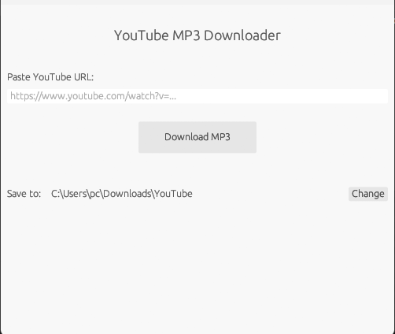

# YouTube MP3 Downloader

A simple, fast GUI application to download YouTube videos as MP3 files.



## Features

- Clean, modern GUI built with Rust + egui
- Real-time download progress bar
- Separate progress indicators for download and conversion phases
- Choose custom save location
- No console window - runs silently in the background
- Custom app icon

## Requirements

- Windows 10/11
- Python 3.x
- yt-dlp
- FFmpeg

### Installing Requirements

#### 1. Install Python

1. Download Python from [python.org](https://www.python.org/downloads/)
2. Run the installer
3. **Important:** Check the box that says "Add Python to PATH" during installation
4. Click "Install Now"

To verify installation, open Command Prompt and type:
```cmd
python --version
```

#### 2. Install yt-dlp

Open Command Prompt and run:
```cmd
pip install yt-dlp
```

To update yt-dlp later:
```cmd
pip install --upgrade yt-dlp
```

#### 3. Install FFmpeg

**Option A: Using winget (Windows 10/11)**
```cmd
winget install FFmpeg
```

**Option B: Manual Installation**
1. Download FFmpeg from [ffmpeg.org](https://ffmpeg.org/download.html) or [gyan.dev](https://www.gyan.dev/ffmpeg/builds/) (recommended for Windows)
2. Download the "ffmpeg-release-essentials.zip" file
3. Extract the zip file to `C:\ffmpeg`
4. Add FFmpeg to your PATH:
   - Press `Win + X` and select "System"
   - Click "Advanced system settings"
   - Click "Environment Variables"
   - Under "System variables", find and select "Path", then click "Edit"
   - Click "New" and add `C:\ffmpeg\bin`
   - Click "OK" on all windows

To verify installation, open a **new** Command Prompt and type:
```cmd
ffmpeg -version
```

## Installation

### Option 1: Download Release
Download the latest `YouTube_MP3.exe` from the [Releases](../../releases) page.

### Option 2: Build from Source

```bash
# Clone the repository
git clone https://github.com/boring877/youtube-mp3-downloader.git
cd youtube-mp3-downloader

# Build release
cargo build --release

# The executable will be at target/release/youtube_downloader.exe
```

## Usage

1. Launch `YouTube_MP3.exe`
2. Paste a YouTube URL in the text box
3. (Optional) Click "Change" to select a different save location
4. Click "Download MP3"
5. Wait for download and conversion to complete
6. Find your MP3 in the Downloads/YouTube folder (or your custom location)

## Default Save Location

```
C:\Users\YOUR_USERNAME\Downloads\YouTube\
```

## Dependencies

This project uses:
- [eframe/egui](https://github.com/emilk/egui) - GUI framework
- [yt-dlp](https://github.com/yt-dlp/yt-dlp) - YouTube downloader
- [dirs-next](https://crates.io/crates/dirs-next) - System directories
- [rfd](https://crates.io/crates/rfd) - File dialogs

## Building

Requirements:
- Rust 1.70+
- Cargo

```bash
cargo build --release
```

## License

MIT License

## Acknowledgments

- [yt-dlp](https://github.com/yt-dlp/yt-dlp) for the amazing YouTube download library
- [egui](https://github.com/emilk/egui) for the beautiful immediate mode GUI
